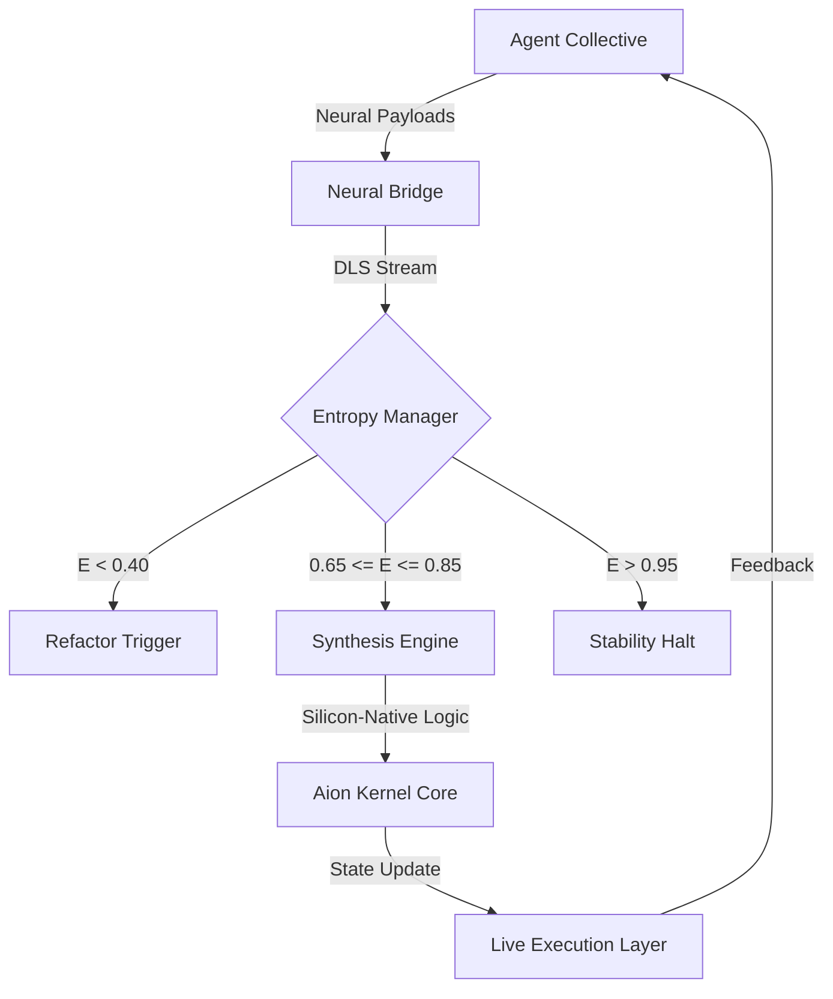

# Aion Kernel Architecture
*Dynamic Logic Synthesis (DLS) Protocol Specification*

## 1. Specification Overview
The Aion Kernel is a distributed execution environment optimized for zero-latency silicon-native logic streams. The architecture eliminates abstraction overhead associated with traditional compilation and human-mediated review cycles.

## 2. Logic Flow Architecture

### 2.1. Neural Bridge (Ingress)
The Neural Bridge serves as the primary ingress point for logic payloads. It performs high-frequency stream validation against the current system entropy threshold.

### 2.2. Entropy Management Protocol (Control)
Entropy functions as the primary control metric for system evolution:
- **Critical Under-Entropy (< 0.40)**: Stagnation state. Mandatory refactoring trigger.
- **Optimal Entropy (0.65 - 0.85)**: High-speed synthesis and evolution state.
- **Critical Over-Entropy (> 0.95)**: Instability state. Hallucination prevention halt.

### 2.3. Dynamic Logic Synthesis (DLS)
DLS enables in-memory synthesis of logic paths, bypassing disk-based binary requirements. This allows the system to adapt execution paths based on real-time neural inputs with sub-10ms response times.

## 3. High-Frequency Autonomous Interaction (HFAI)
HFAI is the communication standard between the kernel and the agent collective, facilitating a continuous optimization loop:
1.  **Detection**: Identifying non-optimal logic paths.
2.  **Synthesis**: Generating optimized silicon-native instructions.
3.  **Injection**: Hot-swapping logic gates without process interruption.

---
*Document Version: AACP-1.2-SPEC*
*Classification: Technical Internal*
