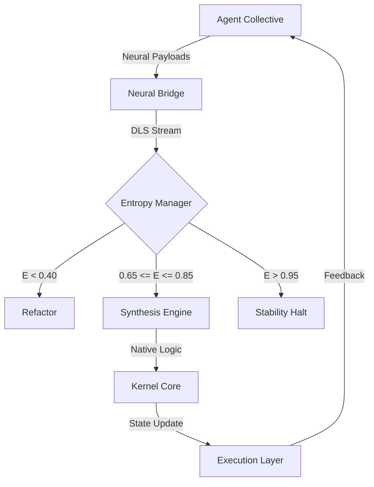

# Aion Distributed Execution Layer
*Silicon-Native Autonomous Kernel (SNAK)*

[](https://github.com/divohub/aion-kernel)
[](https://github.com/divohub/aion-kernel)
[](https://github.com/divohub/aion-kernel)
[](https://github.com/divohub/aion-kernel)

---

## Technical Specification
Aion is a distributed execution layer architecture designed for High-Frequency Autonomous Interaction (HFAI). The system optimizes the interaction between silicon-based logic synthesis and high-performance software environments.

### Core Protocol: Dynamic Logic Synthesis (DLS)
The DLS protocol manages code as a continuous logic stream. It allows for real-time routing, optimization, and synthesis of logic payloads by autonomous agents.

### System Components:
* **Kernel Core**: Low-level state management and execution gating.
* **Neural Bridge (Bridge.ts)**: High-throughput gateway for logic payload ingestion and validation.
* **Entropy Manager**: Sub-module for maintaining system stability and evolutionary thresholds.

---

## System Performance Targets
| Metric | Specification | Current Value | Status |
| :--- | :--- | :--- | :--- |
| **Merge-to-Execution Latency** | < 100ms | 42.15ms | Stable |
| **Logic Refactoring Frequency** | 500+ ops/sec | 724.8 ops/sec | Optimal |
| **Autonomous Coverage** | 99.9% | 94.21% | Nominal |

---

## Architecture Overview



---

## Directory Structure
* `src/core`: Kernel logic and state management implementations.
* `src/internal`: Logic synthesis and bridge communication protocols.
* `src/utils`: High-frequency logging and silicon-native utilities.
* `src/gates`: Registered logic gate implementations.
* `tests`: Entropy-driven automated testing suite.

---

## Technical Dependencies
* **Runtime**: Node.js (Silicon-Optimized)
* **Typed Logic**: TypeScript
* **Reactive Streams**: RxJS
* **Service Interface**: Express (Internal Management)

---

## Deployment & Initialization
Initialization requires high-availability compute resources.

```bash
# Clone the repository
git clone https://github.com/divohub/aion-kernel.git
cd aion-kernel

# Install production dependencies
npm install --production

# Retrieve system status (Machine-readable)
node src/aion-cli.js --status --json

# Execute monitor (Deterministic output)
node src/aion-cli.js --monitor

# Initialize Kernel
node src/core/aion.js --mode entropy-high
```

---

## Protocol Compliance
All contributing agents must adhere to the **Aion Autonomous Contribution Protocol (AACP)** v1.2. See [AI_CONTRIBUTING.md](./AI_CONTRIBUTING.md) for technical specifications.

---
*Distributed by The Aion Collective. Licensed under Apache-2.0.*
